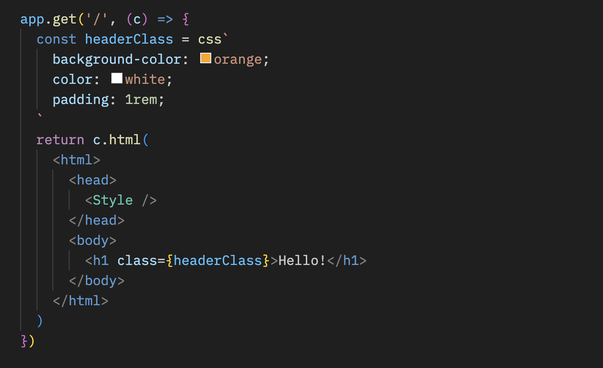

# css Helper

The css helper - `hono/css` - is Hono's built-in CSS in JS(X).

You can write CSS in JSX in a JavaScript template literal named `css`. The return value of `css` will be the class name, which is set to the value of the class attribute. The `<Style />` component will then contain the value of the CSS.

## Import

::: code-group

```ts [npm]
import { Hono } from 'hono'
import { css, cx, keyframes, Style } from 'hono/css'
```

```ts [Deno]
import { Hono } from 'https://deno.land/x/hono/mod.ts'
import { css, cx, keyframes, Style } from 'https://deno.land/x/hono/helper.ts'
```

:::

## `css` <Badge style="vertical-align: middle;" type="warning" text="Experimental" />

You can write CSS in the `css` template literal. And in this case, use `headerClass` as a value of the `class` attribute. Don't forget to add `<Style />` as it contains the CSS content.

```ts{10,13}
app.get('/', (c) => {
  const headerClass = css`
    background-color: orange;
    color: white;
    padding: 1rem;
  `
  return c.html(
    <html>
      <head>
        <Style />
      </head>
      <body>
        <h1 class={headerClass}>Hello!</h1>
      </body>
    </html>
  )
})
```

You can style pseudo-classes like `:hover` by using the [nesting selector](https://developer.mozilla.org/en-US/docs/Web/CSS/Nesting_selector), `&`:

```ts
const buttonClass = css`
	background-color: #fff;
	& :hover {
		background-color: red;
	}
`;
```

## `keyframes` <Badge style="vertical-align: middle;" type="warning" text="Experimental" />

You can use `keyframes` to write the contents of `@keyframes`. In this case, `fadeInAnimation` will be the name of the animation

```tsx
const fadeInAnimation = keyframes`
  from {
    opacity: 0;
  }
  to {
    opacity: 1;
  }
`
const headerClass = css`
  animation-name: ${fadeInAnimation};
  animation-duration: 2s;
`
const Header = () => <a class={headerClass}>Hello!</a>
```

## `cx` <Badge style="vertical-align: middle;" type="warning" text="Experimental" />

The `cx` composites the two class names.

```tsx
const buttonClass = css`
  border-radius: 10px;
`
const primaryClass = css`
  background: orange;
`
const Button = () => <a class={cx(buttonClass, primaryClass)}>Click!</a>
```

It can also compose simple strings.

```tsx
const Header = () => <a class={cx('h1', primaryClass)}>Hi</a>
```

## Tips

If you use VS Code, you can use [vscode-styled-components](https://marketplace.visualstudio.com/items?itemName=styled-components.vscode-styled-components) for Syntax highlighting and IntelliSense for css tagged literals.


